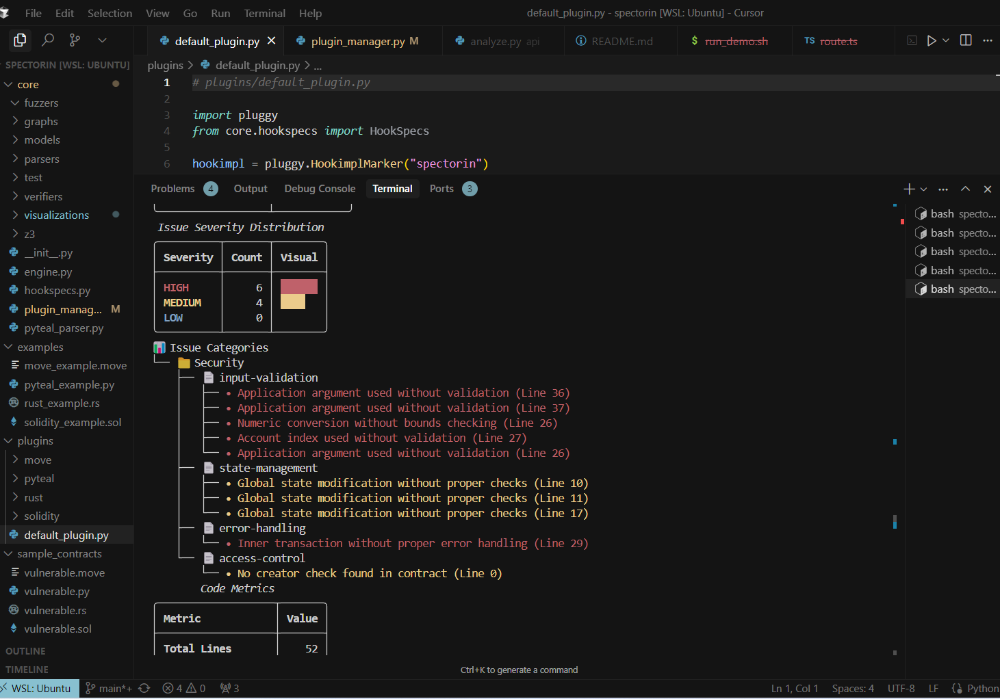
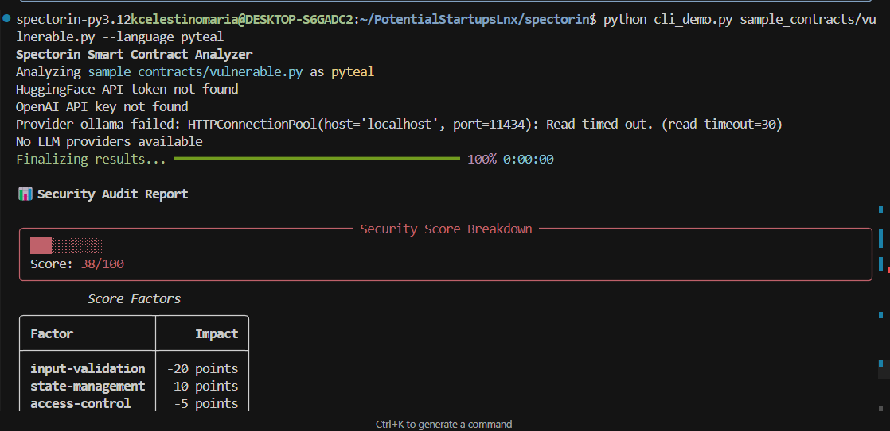

# **Spectorin**

AI-powered smart contract security analyzer with formal verification capabilities.

## Features

- Multi-chain smart contract analysis:
  - Solidity (Ethereum & EVM chains)
  - PyTeal (Algorand)
  - Move (Sui, Aptos)
  - Rust (Solana, Polkadot)
- AI-powered security analysis using:
  - Local models via Ollama (Phi-3 Mini optimized for code analysis)
  - HuggingFace models
  - OpenAI (optional)
- Comprehensive security scoring
- Detailed vulnerability reports
- Actionable security recommendations
- Beautiful CLI interface with rich formatting

## Prerequisites

- Python 3.12 or higher
- Poetry (package manager)
- Ollama (for local AI analysis)

## Installation

```bash
# Clone the repository
git clone https://github.com/yourusername/spectorin.git
cd spectorin

# Install Python dependencies
poetry install

# Install and configure Ollama (if not already installed)
# Follow instructions at: https://ollama.ai/download

# Pull the Phi-3 Mini model (optimized for code analysis, with less memory needs and ideal for local setup)
ollama pull phi3:mini

# Set up environment variables (optional)
cp setup_env.sh.example setup_env.sh
# Edit setup_env.sh with your API keys if you want to use HuggingFace or OpenAI
source setup_env.sh
```

## Usage

### Analyzing Smart Contracts

The main interface is through the CLI demo tool:

```bash
# Basic usage
python cli_demo.py <contract_file> --language <language>

# Examples:
# Analyze Solidity contract
python cli_demo.py sample_contracts/vulnerable.sol --language solidity

# Analyze PyTeal contract
python cli_demo.py sample_contracts/vulnerable.py --language pyteal

# Analyze Move contract
python cli_demo.py sample_contracts/vulnerable.move --language move

# Analyze Rust contract
python cli_demo.py sample_contracts/vulnerable.rs --language rust
```

See screenshots of terminal interface after commands are ran:







### Security Score

The security score is calculated based on multiple factors:
- Code quality metrics
- Vulnerability severity
- Best practices compliance
- Platform-specific security patterns

Score ranges:
- 90-100: Excellent - No significant issues
- 70-89: Good - Minor issues present
- 50-69: Fair - Moderate issues present
- 0-49: Poor - Critical issues present

### Sample Output

The analysis provides:
- Overall security score
- Detailed breakdown of issues
- Severity distribution
- Code metrics
- Actionable recommendations
- Visual representation of findings

## Configuration

### LLM Providers

The tool supports multiple LLM providers:
1. **Ollama** (default, runs locally)
   - Uses Phi-3 Mini model optimized for code analysis
   - No API key required
   - Works offline

2. **HuggingFace** (optional)
   - Requires API token in `.env` or environment
   - Set `HUGGINGFACE_API_TOKEN` environment variable

3. **OpenAI** (optional)
   - Requires API key in `.env` or environment
   - Set `OPENAI_API_KEY` environment variable

## Contributing

Contributions are welcome! Please feel free to submit a Pull Request.

## License

Copyright 2024 Spectorin Contributors

Licensed under the Apache License, Version 2.0 (the "License");
you may not use this file except in compliance with the License.
You may obtain a copy of the License at

    http://www.apache.org/licenses/LICENSE-2.0

Unless required by applicable law or agreed to in writing, software
distributed under the License is distributed on an "AS IS" BASIS,
WITHOUT WARRANTIES OR CONDITIONS OF ANY KIND, either express or implied.
See the License for the specific language governing permissions and
limitations under the License.


